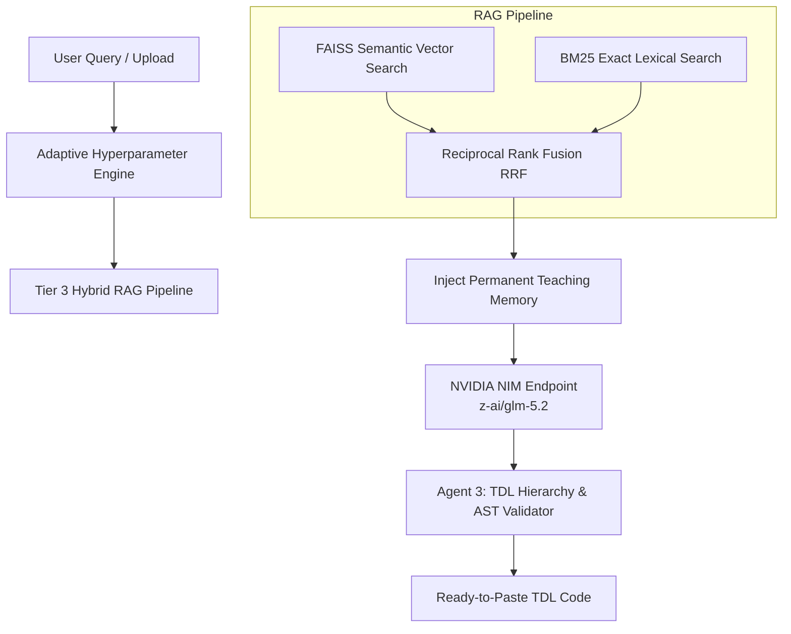

# TDL Enterprise Assistant (TDL-GPT) 🚀

<div align="center">

[-76B900?style=for-the-badge&logo=nvidia&logoColor=white)](https://integrate.api.nvidia.com)
[](https://github.com/ianuj-yadav/TDL-gpt)
[](https://tallysolutions.com)
[](#running-enterprise-tests)

**The Principal Engineer AI for Tally Definition Language (TDL) Development**

[Features](#-core-enterprise-features) • [Architecture](#-architecture--guardrails) • [Installation](#-installation--setup) • [Usage](#-usage) • [Testing](#-running-enterprise-tests)

</div>

---

## 🌟 Overview

**TDL Enterprise Assistant (`TDL-GPT`)** is a state-of-the-art agentic coding assistant and domain-specific RAG system designed exclusively for **Tally Definition Language (TDL)**. Built to solve the unique structural challenges of Tally Prime and Tally ERP 9 add-on development, it eliminates AI hallucinations through a **Tier 3 Hybrid RAG Pipeline**, an **Autonomous TDL AST Hierarchy Validator (Agent 3)**, and **Permanent User Teaching Memory**.

Whether building complex Invoice Customizations, Voucher Event Handlers, Collection Aggregations, or XML/ODBC API integrations, `TDL-GPT` delivers ready-to-paste, production-tested TDL code following strict Tally Object Model rules.

---

## ✨ Core Enterprise Features

### 1. 🧠 Tier 3 Hybrid RAG with Reciprocal Rank Fusion (RRF)
- **Dense Semantic Vector Retrieval**: Employs `SentenceTransformers` + FAISS L2/Cosine indexing to match conceptual developer intents across massive TDL codebases.
- **Sparse Lexical Inverted Index (BM25 / TF-IDF)**: Matches exact TDL identifiers, definition headers (`[Report]`, `[Form]`, `[Part]`), and field definitions.
- **RRF Fusion & Confidence Filtering**: Fuses dense and sparse rankings mathematically and enforces confidence thresholds to prevent retrieving noisy or irrelevant context.

### 2. 🛡️ Autonomous Code Validator & AST Guardrails (Agent 3)
- **Hierarchy Enforcement**: Automatically inspects generated TDL code to guarantee Tally's structural hierarchy:
  $$\text{Report} \longrightarrow \text{Form} \longrightarrow \text{Part} \longrightarrow \text{Line} \longrightarrow \text{Field}$$
- **Dangling Reference Detection**: Flags undefined Form, Part, or Line references before code reaches your `.tdl` file.
- **Infinite Filler Loop Stripping**: Automatically strips repetitive filler comments and endless decorative separators from LLM output.

### 3. ⚡ Adaptive Generation Auto-Tuning
- Dynamically inspects incoming queries and retrieval confidence to adjust generation hyperparameters on the fly:
  - **Deterministic TDL Code Engine**: Sets `temperature=0.15`, `top_p=0.85` for high precision when writing syntax or debugging errors.
  - **Creative Architect Mode**: Sets `temperature=0.65` for brainstorming architecture or add-on ideas.

### 4. 🗃️ Universal Source Extraction (`buildkb.py`)
- Ingests **all source files** automatically (`.tdl`, `.txt`, `.md`, `.json`, `.pdf`, `.docx`, `.xlsx`).
- **Binary/Compiled String Extraction**: Extracts printable ASCII/UTF-8 strings from compiled Tally add-on files (`.tcp`) and legacy `.doc`/`.xls` files so zero valuable source strings are lost.

### 5. 🧠 Permanent User Teaching Memory
- Learns from developer overrides (`[RULE: ...]`, `"remember that ..."`) and stores instructions permanently in `permanent_teachings.json`, automatically injecting them into future AI reasoning contexts.

---

## 🏗️ Architecture & Flow



---

## 📁 Repository Structure

```text
TDL-gpt/
├── chat_bot.py           # Core TDL Principal Engineer AI logic, RAG retrieval & NVIDIA NIM client
├── buildkb.py            # Universal KB indexer (FAISS + BM25 + string extraction for all files)
├── streamlit_app.py      # Interactive multi-tab IDE, Chatbot & TDL Code Workbench UI
├── run_tests.py          # Enterprise 10-phase automated verification & regression suite
├── source_files/         # Repository of TDL add-ons, reference manuals & scripts (699+ files)
├── requirements.txt      # Python dependencies
└── README.md             # Project documentation
```

---

## 🛠️ Installation & Setup

### Prerequisites
- **OS**: Windows / Linux / macOS
- **Python**: Python 3.9+
- **API Key**: NVIDIA NIM API Key (`nvapi-...`) configured for access to `z-ai/glm-5.2`.

### 1. Clone the Repository
```bash
git clone https://github.com/ianuj-yadav/TDL-gpt.git
cd TDL-gpt
```

### 2. Create Virtual Environment & Install Dependencies
```bash
python -m venv venv
# Windows PowerShell:
.\venv\Scripts\Activate.ps1

pip install -r requirements.txt
```

### 3. Build the RAG Knowledge Base
Vectorize and index all TDL source files, documentation, and extracted binary strings:
```bash
python buildkb.py
```

---

## 🚀 Usage

### Launch Interactive Streamlit IDE
Start the web UI workbench:
```bash
streamlit run streamlit_app.py
```
- Open **http://localhost:8501** in your web browser.
- Select your AI model endpoint (`z-ai/glm-5.2` default).
- Ask TDL coding questions, paste error logs, or upload `.tdl` files for instant refactoring.

---

## 🧪 Running Enterprise Tests

To run the complete 10-phase automated unit and regression test suite covering RAG retrieval, hierarchy validation, filler stripping, and memory persistence:

```bash
python run_tests.py
```

### Expected Test Suite Output
```text
=== TDL ENTERPRISE ASSISTANT TEST SUITE ===
[1/10] Importing chat_bot and buildkb... [PASS]
[2/10] Testing check_dangling_references... [PASS]
[3/10] Testing check_attribute_scopes... [PASS]
[4/10] Testing prune_and_summarize_memory... [PASS]
[5/10] Testing validate_and_refine_tdl (filler loops)... [PASS]
[6/10] Testing Smart Chunking functions... [PASS]
[7/10] Testing Tier 3 Sparse Lexical Indexing... [PASS]
[8/10] Testing Agent 3 Structural Hierarchy Validation... [PASS]
[9/10] Testing Tier 3 Hybrid RAG & Confidence Guardrail... [PASS]
[10/10] Testing Adaptive Generation Auto-Tuning & Permanent Teaching Memory... [PASS]

=== ALL 10 ENTERPRISE TESTS PASSED SUCCESSFULLY ===
```

---

## 📄 License

This project is licensed for enterprise development and Tally Definition Language engineering.
Made with Love ❤❤ by Anuj Yadav
